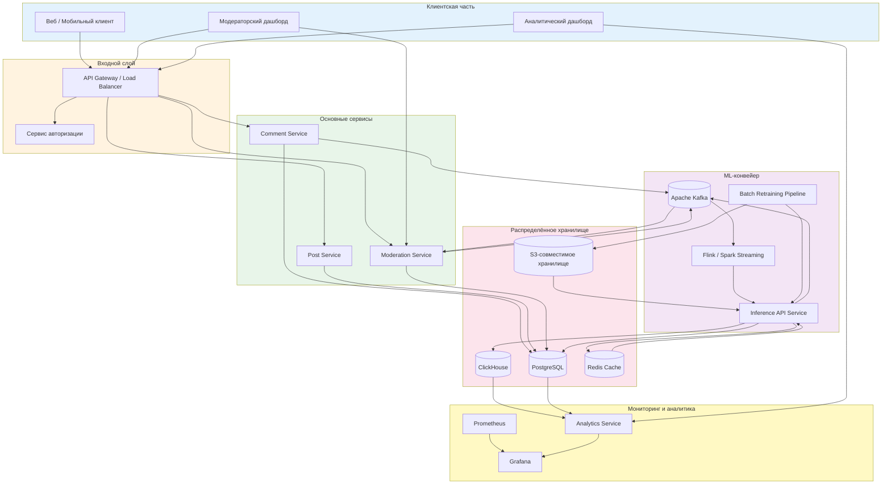

# Диаграмма архитектуры системы

## Описание

Архитектура построена по принципу событийно-ориентированного конвейера (event-driven pipeline). Данные поступают через API Gateway, обрабатываются стриминговым движком, классифицируются ML-сервисом и маршрутизируются. Распределённое хранение обосновано разными паттернами доступа: OLTP для транзакций, OLAP для аналитики, объектное хранилище для артефактов моделей.

## Диаграмма архитектуры

## Обоснование распределённого характера хранения

| Данные | Хранилище | Почему распределённо |
|---|---|---|
| Транзакционные (User, Post, Comment, ModerationAction) | PostgreSQL | Классический OLTP: INSERT/UPDATE, ACID-гарантии, реляционная целостность |
| Аналитические (SentimentReport, FeedbackSignal) | ClickHouse | OLAP: миллионные агрегации по времени, колоночное сжатие, быстрые GROUP BY |
| ML-артефакты (модели, токенизаторы) | S3 | Большие бинарные файлы (100 МБ — 5 ГБ), редкие чтения при деплое, версионирование |
| Кэш предсказаний и сессии | Redis | Sub-ms latency для горячих ключей, TTL-политика, ephemeral nature |

Ключевой принцип: разные паттерны доступа = разные хранилища. Единая «大雪 данных» (data lake) не показана, т.к. на MVP-этапе достаточно указанных четырёх, а расширение до lake возможна на следующих итерациях.