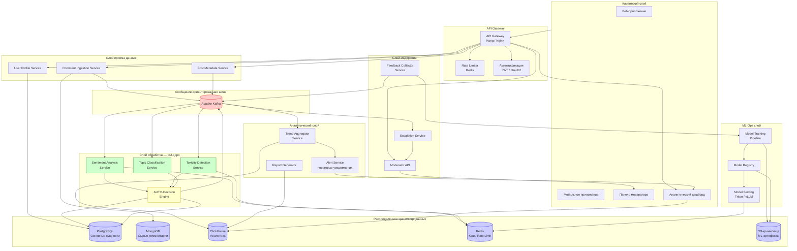

# Диаграмма архитектуры системы

## Общий обзор

Система **Sentinel AI** построена по микросервисной архитектуре с событийно-ориентированным взаимодействием через Apache Kafka. Распределённый характер данных обусловлен различными паттернами доступа и требованиями к производительности.

## Диаграмма архитектуры

## Обоснование распределённого характера работы с данными

Данные в системе распределены между несколькими хранилищами по причине **фундаментально разных паттернов доступа**:

### 1. Разделение по типу нагрузки (OLTP vs OLAP)

| Хранилище | Паттерн нагрузки | Причина разделения |
|---|---|---|
| **PostgreSQL** | OLTP — транзакции | ACID-гарантии для модерационных решений (юридическая значимость), пользовательских банов. Строгая схема данных. |
| **ClickHouse** | OLAP — аналитика | Агрегация миллионов записей по времени, категориям, тональности. Колонковое хранение даёт 10–100x ускорение на аналитических запросах vs PostgreSQL. |
| **MongoDB** | High-Volume Writes | Приём 500K комментариев/день с гибкой схемой. Горизонтальное масштабирование через шардинг. |

### 2. Разделение по требованиям к задержке

| Хранилище | Задержка | Использование |
|---|---|---|
| **Redis** | < 1 мс | Кэш загруженных ML-моделей, rate limiting, сессии модераторов |
| **PostgreSQL** | 1–10 мс | Чтение/запись решений модерации |
| **MongoDB** | 1–10 мс | Запись входящих комментариев |
| **ClickHouse** | 10–100 мс | Агрегатные запросы для дашбордов |
| **S3** | 100–500 мс | Хранение артефактов (модели, логи) |

### 3. Разделение по формату данных

- **Структурированные данные** (пользователи, решения, баны) → PostgreSQL
- **Полуструктурированные данные** (комментарии с меняющейся метаинформацией) → MongoDB
- **Временные ряды / агрегаты** (тренды тональности) → ClickHouse
- **Бинарные артефакты** (ML-модели) → S3

### 4. Kafka как связующая ткань

Apache Kafka обеспечивает:
- **Децентрализацию**: продюсеры и консьюмеры не знают друг о друге
- **Гарантию доставки**: at-least-once семантика для модерационных решений
- **Реплей**: возможность переобработки комментариев при обновлении ML-модели
- **Масштабирование**: консьюмер-группы позволяют горизонтально масштабировать обработку

## Характеристики развёртывания

| Компонент | Развёртывание | Масштабирование |
|---|---|---|
| API Gateway | Kubernetes, 2+ реплики | По CPU/RPS |
| Ingestion Services | Kubernetes, 3+ реплики | По объёму входящего потока |
| ML-Services | Kubernetes + GPU-узлы | По GPU-утилизации |
| Kafka | 3+ брокера, replication factor=3 | По throughput |
| PostgreSQL | Primary + 2 Replica | Read-replica для аналитики |
| MongoDB | Replica Set (3 узла) | Шардинг при росте |
| ClickHouse | Кластер 3+ узлов | По объёму аналитики |
| Redis | Sentinel (3 узла) | По hit-rate |