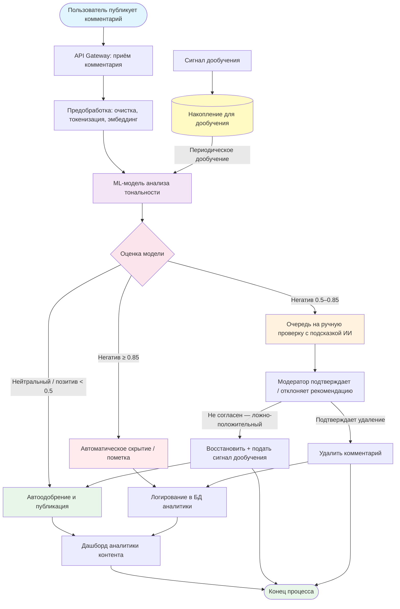

# Бизнес-процесс модерации контента (после внедрения ИИ-системы)

## Описание

Диаграмма изображает процесс модерации комментариев после внедрения ML-системы анализа тональности. ИИ-модель автоматически классифицирует входящие комментарии в реальном времени, перенаправляя подозрительный контент модераторам с предзаполненными рекомендации. Ручная обработка сокращается до ~3-5% от общего объёма.

## Диаграмма BPMN

## Ключевые изменения, которые вносит ИИ-система

| Аспект | До | После |
|---|---|---|
| Покрытие | < 5% комментариев | 100% комментариев |
| Время реакции | 2–24 часа | < 1 секунда (автоматически) / < 15 мин (человек) |
| Стоимость | 30+ модераторов | 5–7 модераторов для граничных случаев |
| Объективность | Субъективные решения | Консистентная модель + человеческий контроль |
| Риск штрафов РКН | Высокий | Минимальный (автоматическое скрытие) |
| Аналитика | Отсутствует | Дашборд тональности в реальном времени |