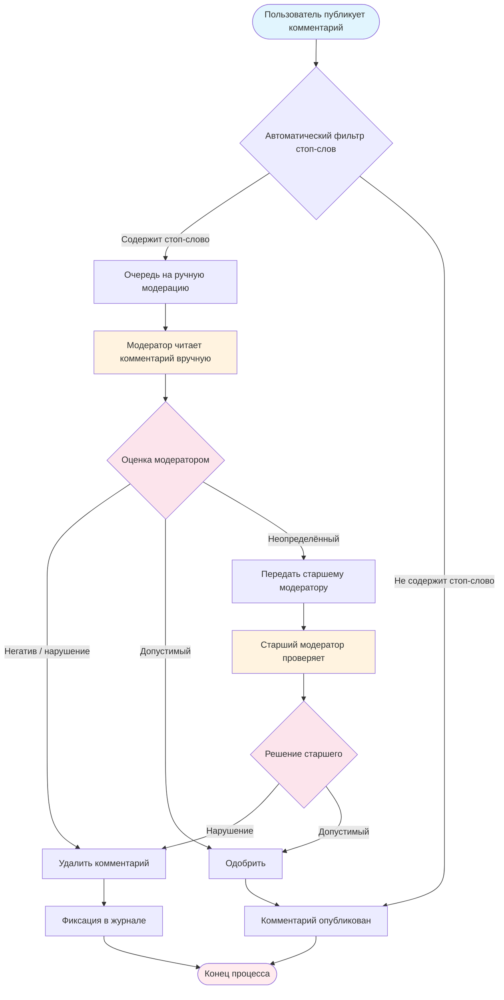

# Бизнес-процесс модерации контента (до внедрения ИИ-системы)

## Описание

Диаграмма изображает текущий (ручной) процесс модерации комментариев в социальной сети. Модераторы вручную читают выборочные комментарии, принимают решения об удалении и escalation. Процесс медленный, дорогой и субъективный.

## Диаграмма BPMN

## Узкие места текущего процесса

| Проблема | Оценка |
|---|---|
| Пропускная способность | ~500 000 комментариев/день; ручная модерация покрывает < 5% |
| Время реакции | От 2 до 24 часов до принятия решения |
| Субъективность | Разные модераторы по-разному оценивают граничные случаи |
| Стоимость | 30+ модераторов в смену, высокой текучка |
| Риск штрафов РКН | Неприемлемый контент может оставаться опубликованным часами |