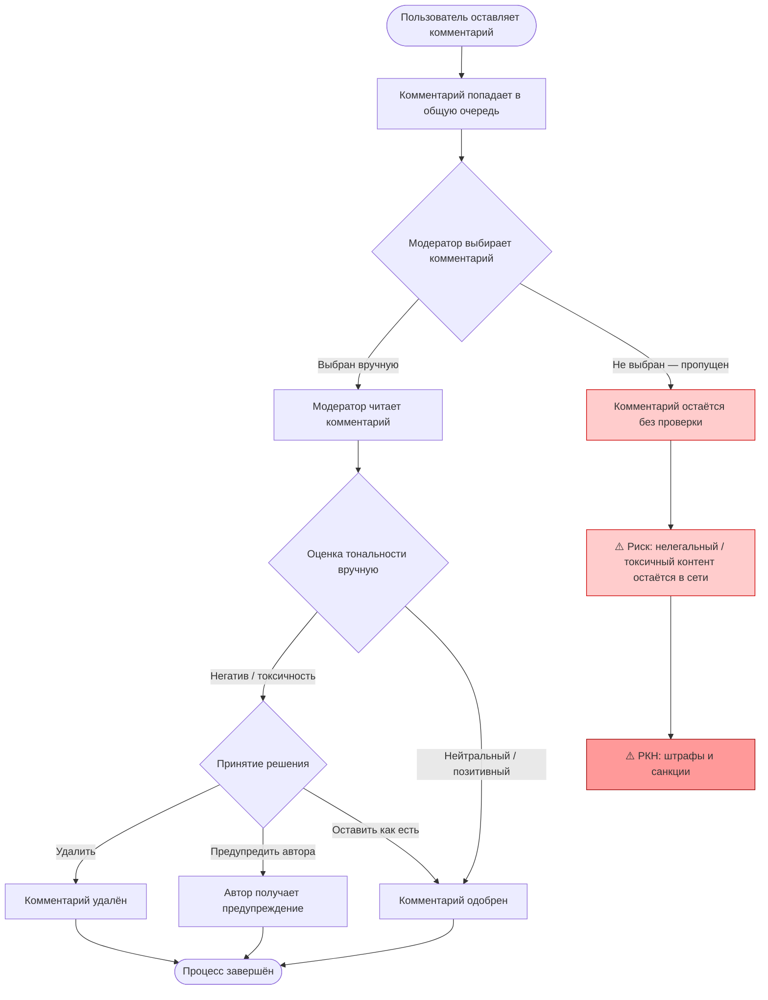

# Модель бизнес-процесса «КАК ЕСТЬ» (As-Is)

## Описание текущего процесса модерации контента

В настоящее время анализ тональности комментариев в социальной сети проводится **вручную** либо **не проводится вообще**. Модераторы читают выборочные комментарии, что делает процесс медленным, дорогим и субъективным. При ежедневном потоке до 500 000 комментариев ручная модерация покрывает лишь малую долю контента.

## BPMN-диаграмма (As-Is)

## Участники процесса (As-Is)

| Участник | Роль |
|---|---|
| Пользователь | Оставляет комментарии к постам, рекламе, новостям |
| Модератор | Выборочно читает и оценивает комментарии вручную |
| РКН | Внешний регулятор, контролирующий качество модерации |

## Проблемы текущего процесса

1. **Масштаб**: до 500 000 комментариев/день — ручная модерация покрывает < 5%
2. **Субъективность**: решение зависит от конкретного модератора, нет единых критериев
3. **Задержка**: от момента публикации комментария до проверки — часы или дни
4. **Риски**: непроверенные комментарии могут содержать незаконный контент → штрафы РКН
5. **Стоимость**: расширение штата модераторов линейно растёт с объёмом комментариев
6. **Нет аналитики**: отсутствие данных о трендах тональности, нельзя прогнозировать всплески негатива

## Количественные показатели (As-Is)

| Показатель | Значение |
|---|---|
| Объём входящих комментариев/день | до 500 000 |
| Доля проверенных комментариев | ~3–5% |
| Среднее время реакции на токсичный контент | 4–24 часа |
| Стоимость модерации (ФОТ модераторов) | высокая, пропорциональна штату |
| Риск штрафов РКН | высокий |