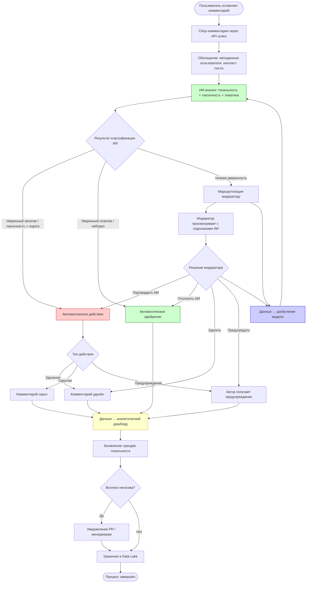

# Модель бизнес-процесса «КАК ДОЛЖНО БЫТЬ» (To-Be)

## Описание целевого процесса

После внедрения ИИ-системы **Sentinel AI** анализ тональности и модерация автоматизированы: ML-модели реальном времени классифицируют каждый комментарий, принимают предварительные решения и маршрутизируют пограничные случаи на ручную проверку. Модераторы концентрируются на сложных случаях, а не на массовом потоке.

## BPMN-диаграмма (To-Be)

## Что меняет ИИ-система в бизнес-процессе

| Аспект | As-Is (ручной) | To-Be (с ИИ) |
|---|---|---|
| **Охват** | 3–5% комментариев | 100% комментариев |
| **Скорость реакции** | 4–24 часа | < 1 секунда для 85%+ случаев |
| **Объективность** | Субъективная оценка модератора | Единая модель с настраиваемыми порогами |
| **Стоимость** | Линейный рост ФОТ | Фиксированные расходы на инфраструктуру + модель |
| **Риск штрафов РКН** | Высокий | Минимальный (полное покрытие) |
| **Аналитика** | Отсутствует | Реалтайм дашборды, тренды, прогнозы |

## Участники процесса (To-Be)

| Участник | Роль |
|---|---|
| Пользователь | Оставляет комментарии |
| ИИ-система Sentinel AI | Автоматическая классификация, принятие решений, аналитика |
| Модератор | Обработка пограничных случаев (escalation), валидация решений ИИ |
| PR-менеджер / контент-менеджер | Реагирование на всплески негатива по уведомлениям |
| Data Engineer | Поддержание пайплайнов данных, переобучение модели |

## Количественные цели (To-Be)

| Показатель | Целевое значение |
|---|---|
| Охват комментариев | 100% |
| Доля автоматических решений | ≥ 85% |
| Среднее время реакции на токсичный контент | < 1 секунда |
| Доля эскалаций модераторам | ≤ 15% |
| Точность классификации (F1) | ≥ 0.92 |
| Снижение риска штрафов РКН | До минимального |