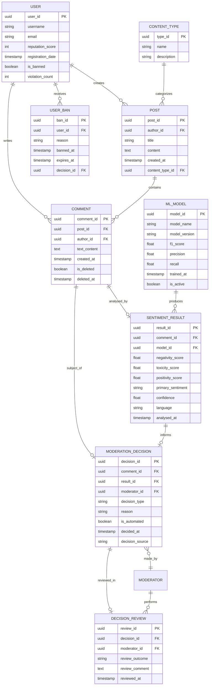

# Диаграмма структуры данных — ER-модель

## Обоснование выбора БД

Система использует **гибридную архитектуру данных** — распределённое хранение, оптимальное для разных типов нагрузки:

| Хранилище | Тип | Назначение |
|---|---|---|
| **PostgreSQL** | Реляционная | Основные сущности (пользователи, посты, комментарии, решения модерации) — транзакционная целостность |
| **MongoDB** | Документная | Сырые входящие комментарии в оригинальном формате (JSON) — гибкая схема, высокий Writes/sec |
| **ClickHouse** | Колонковая | Аналитика, агрегация тональности по временным срезам — быстрые OLAP-запросы |
| **Redis** | Ключ-значение (in-memory) | Кэш моделей, сессии, rate limiting — суб-миллисекундный доступ |
| **S3-совместимое** | Объектное | Хранение артефактов ML-моделей, логов предсказаний — долговременное хранение |

## ER-диаграмма (основная реляционная модель — PostgreSQL)



## Документная модель (MongoDB) — сырые комментарии

```json
{
  "_id": "ObjectId",
  "comment_id": "UUID",
  "raw_text": "Оригинальный текст комментария",
  "metadata": {
    "platform": "web|ios|android",
    "client_version": "3.2.1",
    "ip_hash": "sha256...",
    "user_agent": "Mozilla/5.0..."
  },
  "enrichment": {
    "user_reputation": 85,
    "post_category": "politics",
    "thread_position": 12,
    "parent_comment_id": null,
    "has_attachments": false
  },
  "processing_status": "pending|processed|escalated|failed",
  "received_at": "ISO8601 timestamp",
  "processed_at": "ISO8601 timestamp | null"
}
```

## Аналитическая модель (ClickHouse) — агрегация

```sql
-- Пример таблицы для аналитики тональности
CREATE TABLE sentiment_analytics (
    date Date,
    hour UInt8,
    content_type_id UUID,
    sentiment_category Enum8('positive'=1, 'neutral'=2, 'negative'=3, 'toxic'=4),
    total_comments UInt64,
    avg_negativity Float32,
    avg_toxicity Float32,
    auto_moderated UInt64,
    escalated UInt64,
    false_positive_rate Float32
)
ENGINE = MergeTree()
ORDER BY (date, hour, content_type_id);
```

## Распределённый характер данных — обоснование

Различные хранилища необходимы из-за **принципиально разных паттернов доступа**:

1. **PostgreSQL** — транзакционные операции (создание комментария, запись решения модерации). Нужна ACID-целостность для юридически значимых решений модерации и банов пользователей.

2. **MongoDB** — приём и буферизация входящего потока (до 500K/день). Гибкая схема позволяет хранить комментарии разной структуры без миграций. Высокая скорость записи критична для реалтайм-пайплайна.

3. **ClickHouse** — агрегатные запросы для дашбордов и аналитики (тренды тональности по часам, дням, категориям контента). Колонковое хранение обеспечивает производительность на терабайтах данных при миллисекундных откликах.

4. **Redis** — кэширование ML-моделей (загруженных в память для инференса) и rate limiting API. In-memory доступ критичен для <1 секунды времени реакции.

5. **S3** — долговременное хранение артефактов: чекпойнты моделей, батчи предсказаний для дообучения, логи аудита.

Данные перемещаются между хранилищами через **пайплайн Apache Kafka**, обеспечивающий надёжную доставку и разделение продюсеров/консьюмеров.