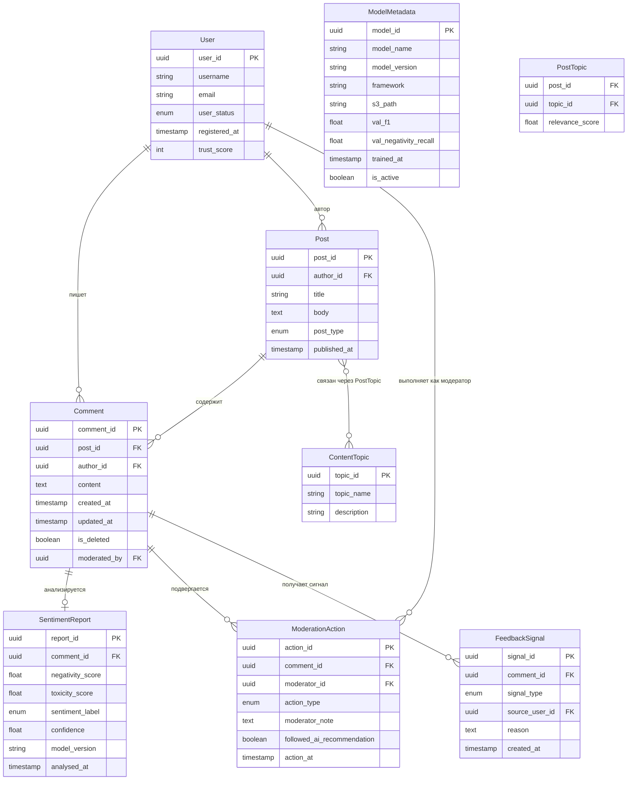

# Диаграмма структуры данных (ER-модель)

## Описание

Ниже представлена ER-диаграмма основной структуры данных системы. Спроектирована для гибридного хранилища: реляционная PostgreSQL — для транзакционных данных, ClickHouse — для аналитики, S3-совместимое хранилище — для моделей и артефактов.

## ER-диаграмма

## Распределённый характер хранения данных

| Сущность | Хранилище | Причина |
|---|---|---|
| User, Post, Comment | PostgreSQL (OLTP) | Транзакционные данные, ACID, целостность ссылок |
| SentimentReport | ClickHouse (OLAP) | Аналитические запросы, агрегация по времени, фильтрация миллионов строк |
| ModelMetadata | PostgreSQL + S3 | Метаданные в PostgreSQL, артефакты модели (веса) в S3 |
| FeedbackSignal | ClickHouse | Потоковые сигналы для дообучения, агрегация |