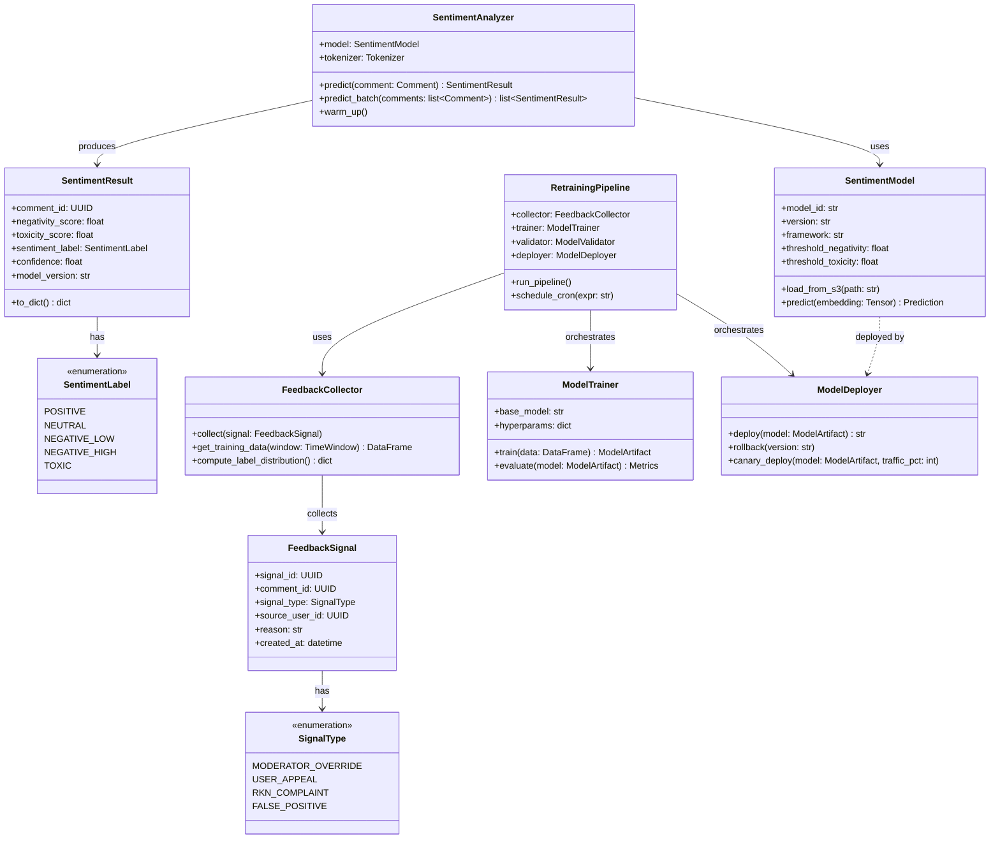

# UML-диаграмма компонентов системы

## Описание

Диаграмма компонентов показывает архитектурное разбиение системы на модули, их интерфейсы и зависимости. Каждый компонент отвечает за отдельную бизнес-область и communicates через определённые контракты.

## Диаграмма компонентов

```mermaid
graph TB
    subgraph Frontend["Слой представления"]
        WebUI[Web Client]
        ModDash[Moderator Dashboard]
        AnDash[Analytics Dashboard]
    end

    subgraph Gateway["API-шлюз"]
        APIGW[API Gateway]
    end

    subgraph Backend["Бэкенд-сервисы"]
        CS[Comment Service<br/>––––––––<br/>+ createComment()<br/>+ getComments()<br/>+ deleteComment()]
        PS[Post Service<br/>––––––––<br/>+ getPost()<br/>+ listPosts()]
        MS[Moderation Service<br/>––––––––<br/>+ reviewAction()<br/>+ getQueue()<br/>+ overrideDecision()]
        US[User Service<br/>––––––––<br/>+ getUser()<br/>+ updateTrustScore()]
        AS[Analytics Service<br/>––––––––<br/>+ getSentimentTrends()<br/>+ getModerationStats()]
    end

    subgraph MLCore["ML-ядро"]
        IS[Inference Service<br/>––––––––<br/>+ predictSentiment()<br/>+ predictToxicity()<br/>+ healthCheck()]
        RP[Retraining Pipeline<br/>––––––––<br/>+ collectFeedback()<br/>+ trainModel()<br/>+ deployModel()]
        PP[Preprocessing Module<br/>––––––––<br/>+ normalizeText()<br/>+ tokenize()<br/>+ generateEmbedding()]
    end

    subgraph Infrastructure["Инфраструктура"]
        MQ[Message Queue<br/>Kafka]
        PG[(PostgreSQL)]
        CH[(ClickHouse)]
        S3[(S3 Storage)]
        RD[(Redis)]
    end

    WebUI --> APIGW
    ModDash --> APIGW
    AnDash --> APIGW

    APIGW --> CS
    APIGW --> PS
    APIGW --> MS
    APIGW --> US
    APIGW --> AS

    CS --> MQ
    MS --> MQ
    CS --> PG
    PS --> PG
    US --> PG
    MS --> PG

    MQ --> PP
    PP --> IS
    IS --> CH
    IS --> PG
    IS --> RD

    MQ --> MS
    RP --> S3
    RP --> IS
    IS --> S3

    AS --> CH
    AS --> PG

    style Frontend fill:#e3f2fd
    style Gateway fill:#fff3e0
    style Backend fill:#e8f5e9
    style MLCore fill:#f3e5f5
    style Infrastructure fill:#fce4ec
```

## UML-диаграмма классов (ключевые сущности ML-ядра)

