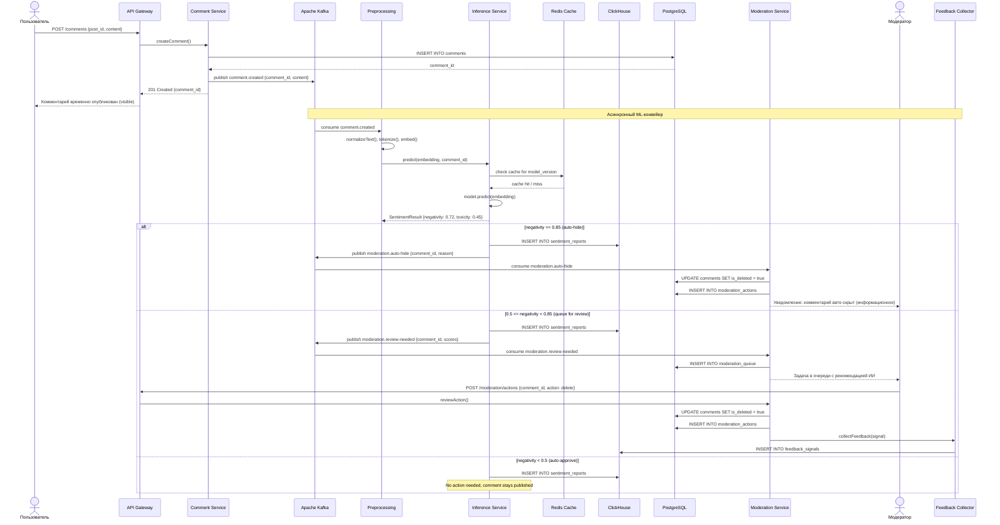

# UML-диаграмма последовательности: обработка нового комментария

## Описание

Диаграмма последовательности показывает основной сценарий обработки нового пользовательского комментария: от публикации до принятия решения о модерации. Охватывает как автоматический (ИИ), так и ручной (модератор) пути.

## Диаграмма последовательности



## Альтернативный сценарий: ложноположительный результат (модератор не согласен с ИИ)

```mermaid
sequenceDiagram
    actor Mod as Модератор
    participant API as API Gateway
    participant MS as Moderation Service
    participant PG as PostgreSQL
    participant FC as Feedback Collector
    participant CH as ClickHouse
    participant RP as Retraining Pipeline

    Mod->>API: POST /moderation/actions {comment_id, action: reinstate, override: true}
    API->>MS: overrideDecision()
    MS->>PG: UPDATE comments SET is_deleted = false
    MS->>PG: INSERT INTO moderation_actions {followed_ai: false}
    MS->>FC: collectFeedback(LO Público_POSITIVE)
    FC->>CH: INSERT INTO feedback_signals {type: FALSE_POSITIVE}
    FC->>RP: notify feedback_collected

    Note over RP: Сигнал накапливается;<br/>дообучение запускается по расписанию (еженедельно)

    RP->>RP: После накопления ≥ N сигналов:<br/>train() → validate() → canary_deploy()
```