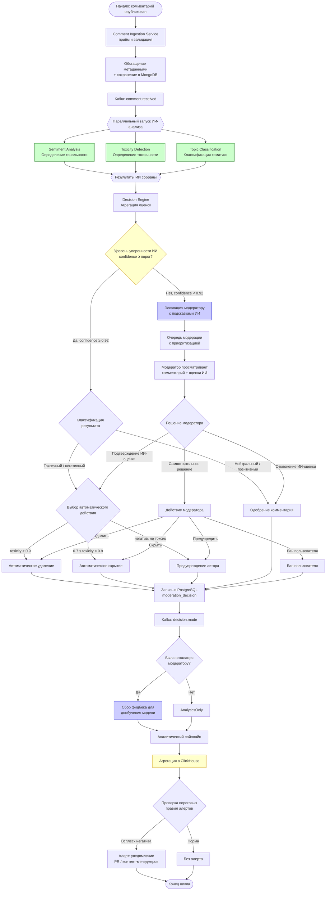
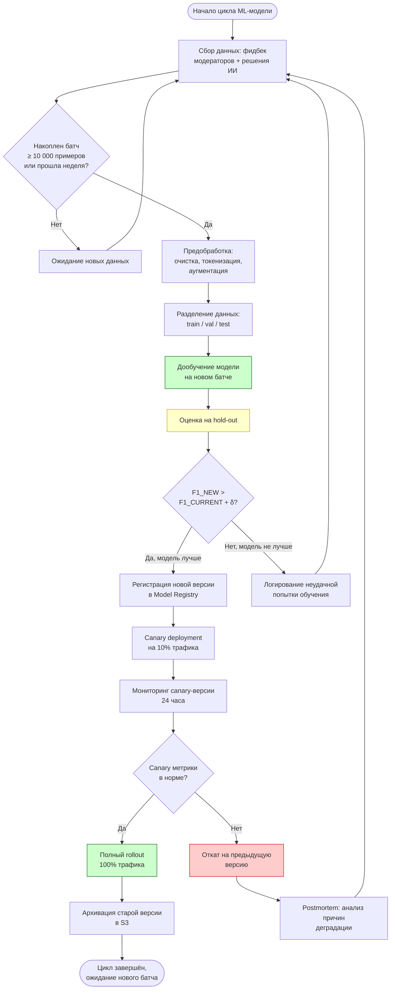

# UML-диаграмма активностей

## Диаграмма активностей: Полный цикл обработки комментария

```mermaid
flowchart TD
    Start([Начало: комментарий опубликован]) --> Receive[Comment Ingestion Service<br/>приём и валидация]
    Receive --> Enrich[Обогащение метаданными<br/>+ сохранение в MongoDB]
    Enrich --> Publish[Kafka: comment.received]
    Publish --> Fork1{{Параллельный запуск ИИ-анализа}}
    
    %% Параллельные ветки
    Fork1 --> Sentiment[Sentiment Analysis<br/>Определение тональности]
    Fork1 --> Toxicity[Toxicity Detection<br/>Определение токсичности]
    Fork1 --> Topic[Topic Classification<br/>Классификация тематики]
    
    Sentiment --> Merge1
    Toxicity --> Merge1
    Topic --> Merge1
    
    Merge1{{Результаты ИИ собраны}} --> Aggregate[Decision Engine<br/>Агрегация оценок]
    Aggregate --> Confidence{Уровень уверенности ИИ<br/>confidence ≥ порог?}
    
    %% Высокая уверенность — автоматическая ветка
    Confidence -->|Да, confidence ≥ 0.92| AutoClassify{Классификация результата}
    
    AutoClassify -->|Токсичный / негативный| ToxicAction{Выбор автоматического действия}
    AutoClassify -->|Нейтральный / позитивный| Approve[Одобрение комментария]
    
    ToxicAction -->|toxicity ≥ 0.9| Delete[Автоматическое удаление]
    ToxicAction -->|0.7 ≤ toxicity < 0.9| Hide[Автоматическое скрытие]
    ToxicAction -->|негатив, не токсик| Warn[Предупреждение автора]
    
    %% Низкая уверенность — эскалация
    Confidence -->|Нет, confidence < 0.92| Escalate[Эскалация модератору<br/>с подсказками ИИ]
    Escalate --> ModQueue[Очередь модерации<br/>с приоритизацией]
    ModQueue --> ModReview[Модератор просматривает<br/>комментарий + оценки ИИ]
    ModReview --> ModDecide{Решение модератора}
    
    ModDecide -->|Подтверждение ИИ-оценки| ToxicAction
    ModDecide -->|Отклонение ИИ-оценки| Approve
    ModDecide -->|Самостоятельное решение| UserAction[Действие модератора]
    
    UserAction -->|Удалить| Delete
    UserAction -->|Скрыть| Hide
    UserAction -->|Предупредить| Warn
    UserAction -->|Бан пользователя| BanUser[Бан пользователя]
    
    %% 所有 действия后记录
    Delete --> LogDecision[Запись в PostgreSQL<br/>moderation_decision]
    Hide --> LogDecision
    Warn --> LogDecision
    Approve --> LogDecision
    BanUser --> LogDecision
    
    LogDecision --> KafkaPublish[Kafka: decision.made]
    KafkaPublish --> FeedbackCheck{Была эскалация<br/>модератору?}
    
    FeedbackCheck -->|Да| CollectFeedback[Сбор фидбека для<br/>дообучения модели]
    FeedbackCheck -->|Нет| AnalyticsOnly
    
    CollectFeedback --> AnalyticsPipeline
    AnalyticsOnly --> AnalyticsPipeline[Аналитический пайплайн]
    
    AnalyticsPipeline --> Aggregation[Агрегация в ClickHouse]
    Aggregation --> TrendCheck{Проверка пороговых<br/>правил алертов}
    
    TrendCheck -->|Всплеск негатива| Alert[Алерт: уведомление<br/>PR / контент-менеджеров]
    TrendCheck -->|Норма| NoAlert[Без алерта]
    
    Alert --> End([Конец цикла])
    NoAlert --> End

    style Sentiment fill:#ccffcc,stroke:#006600
    style Toxicity fill:#ccffcc,stroke:#006600
    style Topic fill:#ccffcc,stroke:#006600
    style Confidence fill:#ffffcc,stroke:#cc9900
    style Escalate fill:#ccccff,stroke:#0000cc
    style CollectFeedback fill:#ccccff,stroke:#0000cc
    style Aggregation fill:#ffffcc,stroke:#cc9900
```

## Диаграмма активностей: Жизненный цикл ML-модели

```mermaid
flowchart TD
    Start([Начало цикла ML-модели]) --> DataCollection[Сбор данных: фидбек<br/>модераторов + решения ИИ]
    DataCollection --> BatchCheck{Накоплен батч<br/>≥ 10 000 примеров<br/>или прошла неделя?}
    
    BatchCheck -->|Нет| Wait[Ожидание новых данных]
    Wait --> DataCollection
    
    BatchCheck -->|Да| Preprocess[Предобработка:<br/>очистка, токенизация,<br/>аугментация]
    Preprocess --> TrainSplit[Разделение данных:<br/>train / val / test]
    TrainSplit --> FineTune[Дообучение модели<br/>на новом батче]
    
    FineTune --> Evaluate[Оценка на hold-out]
    Evaluate --> Compare{F1_NEW ><br/>F1_CURRENT + δ?}
    
    Compare -->|Да, модель лучше| Register[Регистрация новой версии<br/>в Model Registry]
    Compare -->|Нет, модель не лучше| LogFail[Логирование неудачной<br/>попытки обучения]
    LogFail --> DataCollection
    
    Register --> DeployCanary[Canary deployment<br/>на 10% трафика]
    DeployCanary --> CanaryMonitor[Мониторинг canary-версии<br/>24 часа]
    
    CanaryMonitor --> CanaryCheck{Canary метрики<br/>в норме?}
    
    CanaryCheck -->|Да| Rollout[Полный rollout<br/>100% трафика]
    CanaryCheck -->|Нет| Rollback[Откат на предыдущую<br/>версию]
    
    Rollout --> Archive[Архивация старой версии<br/>в S3]
    Rollback --> Postmortem[Postmortem: анализ причин<br/>деградации]
    
    Archive --> End([Цикл завершён,<br/>ожидание нового батча])
    Postmortem --> DataCollection

    style FineTune fill:#ccffcc,stroke:#006600
    style Evaluate fill:#ffffcc,stroke:#cc9900
    style Rollout fill:#ccffcc,stroke:#006600
    style Rollback fill:#ffcccc,stroke:#cc0000
```