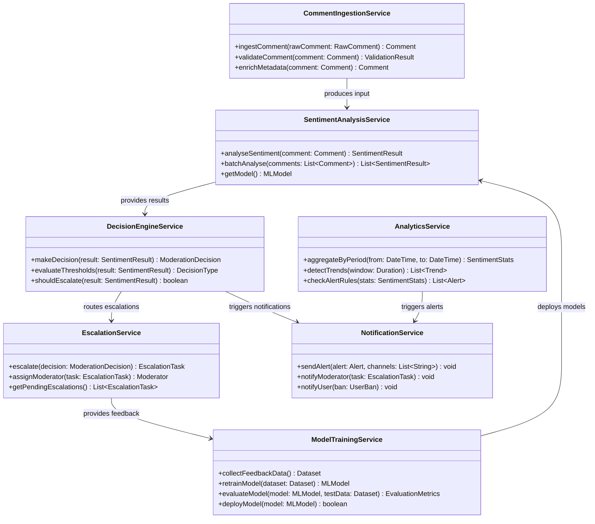

# UML-диаграмма классов

## Диаграмма классов — доменная модель

```mermaid
classDiagram
    class Comment {
        +UUID commentId
        +UUID postId
        +UUID authorId
        +String textContent
        +DateTime createdAt
        +boolean isDeleted
        +DateTime deletedAt
        +getAuthor() User
        +getPost() Post
        +getSentimentResult() SentimentResult
        +getModerationDecision() ModerationDecision
    }
    
    class User {
        +UUID userId
        +String username
        +String email
        +int reputationScore
        +DateTime registrationDate
        +boolean isBanned
        +int violationCount
        +getComments() List~Comment~
        +getPosts() List~Post~
        +getBans() List~UserBan~
        +incrementViolationCount()
        +ban(reason: String, duration: Duration)
    }
    
    class Post {
        +UUID postId
        +UUID authorId
        +String title
        +String content
        +DateTime createdAt
        +ContentType contentType
        +getAuthor() User
        +getComments() List~Comment~
        +getSentimentStats() SentimentStats
    }
    
    class ContentType {
        <<enumeration>>
        NEWS
        ADVERTISEMENT
        USER_POST
        PROMOTION
    }
    
    class SentimentResult {
        +UUID resultId
        +UUID commentId
        +UUID modelId
        +float negativityScore
        +float toxicityScore
        +float positivityScore
        +SentimentLabel primarySentiment
        +float confidence
        +String language
        +DateTime analysedAt
        +getComment() Comment
        +getModel() MLModel
        +isToxic() boolean
        +escalateNeeded() boolean
    }
    
    class SentimentLabel {
        <<enumeration>>
        POSITIVE
        NEUTRAL
        NEGATIVE
        TOXIC
    }
    
    class ModerationDecision {
        +UUID decisionId
        +UUID commentId
        +UUID resultId
        +UUID moderatorId
        +DecisionType decisionType
        +String reason
        +boolean isAutomated
        +DecisionSource decisionSource
        +DateTime decidedAt
        +getComment() Comment
        +getSentimentResult() SentimentResult
        +getModerator() Moderator
        +getReview() DecisionReview
    }
    
    class DecisionType {
        <<enumeration>>
        APPROVE
        DELETE
        HIDE
        WARN
        BAN_USER
    }
    
    class DecisionSource {
        <<enumeration>>
        AUTO_HIGH_CONFIDENCE
        AUTO_RULE_BASED
        MANUAL_MODERATOR
        MANUAL_APPEAL
    }
    
    class DecisionReview {
        +UUID reviewId
        +UUID decisionId
        +UUID moderatorId
        +ReviewOutcome reviewOutcome
        +String reviewComment
        +DateTime reviewedAt
        +getDecision() ModerationDecision
        +getModerator() Moderator
    }
    
    class ReviewOutcome {
        <<enumeration>>
        CONFIRMED
        OVERRULED
        MODIFIED
    }
    
    class Moderator {
        +UUID moderatorId
        +UUID userId
        +String specialization
        +int decisionsCount
        +int escalationsHandled
        +List~String~ categories
        +makeDecision(comment: Comment, decision: DecisionType, reason: String) ModerationDecision
        +reviewDecision(decision: ModerationDecision, outcome: ReviewOutcome) DecisionReview
    }
    
    class MLModel {
        +UUID modelId
        +String modelName
        +String modelVersion
        +float f1Score
        +float precision
        +float recall
        +DateTime trainedAt
        +boolean isActive
        +predict(comment: Comment) SentimentResult
        +retrain(feedbackData: List~DecisionReview~) MLModel
    }
    
    class UserBan {
        +UUID banId
        +UUID userId
        +String reason
        +DateTime bannedAt
        +DateTime expiresAt
        +UUID decisionId
        +getUser() User
        +getDecision() ModerationDecision
        +isActive() boolean
    }
    
    class SentimentStats {
        +UUID postId
        +int totalComments
        +float avgNegativity
        +float avgToxicity
        +int positiveCount
        +int neutralCount
        +int negativeCount
        +int toxicCount
        +DateTime calculatedAt
        +getNegativeTrend() float
    }
    
    class AlertRule {
        +UUID ruleId
        +String name
        +AlertCondition condition
        +float threshold
        +Duration timeWindow
        +List~String~ notifyChannels
        +evaluate(stats: SentimentStats) boolean
    }
    
    class AlertCondition {
        <<enumeration>>
        NEGATIVITY_SPIKE
        TOXICITY_ABOVE_THRESHOLD
        COMMENT_VOLUME_SPIKE
        FALSE_POSITIVE_RATE_HIGH
    }

    User "1" --> "*" Comment : writes
    User "1" --> "*" Post : creates
    User "1" --> "*" UserBan : receives
    Post "1" --> "*" Comment : contains
    Comment "1" --> "0..1" SentimentResult : analysed by
    Comment "1" --> "0..1" ModerationDecision : subject of
    SentimentResult "1" --> "0..1" ModerationDecision : informs
    ModerationDecision "1" --> "0..1" DecisionReview : reviewed in
    ModerationDecision "*" --> "1" Moderator : made by
    SentimentResult "*" --> "1" MLModel : produced by
    Moderator "1" --> "*" DecisionReview : performs
    Post "1" --> "1" SentimentStats : aggregated in
    AlertRule "1" --> "1" AlertCondition : defines
    ContentType "1" --> "*" Post : categorizes
    SentimentLabel "1" --> "*" SentimentResult : labels
    DecisionType "1" --> "*" ModerationDecision : classifies
    DecisionSource "1" --> "*" ModerationDecision : sources
    ReviewOutcome "1" --> "*" DecisionReview : outcomes
```

## Ключевые доменные сервисы

```mermaid
classDiagram
    class CommentIngestionService {
        +ingestComment(rawComment: RawComment) Comment
        +validateComment(comment: Comment) ValidationResult
        +enrichMetadata(comment: Comment) Comment
    }
    
    class SentimentAnalysisService {
        +analyseSentiment(comment: Comment) SentimentResult
        +batchAnalyse(comments: List~Comment~) List~SentimentResult~
        +getModel() MLModel
    }
    
    class DecisionEngineService {
        +makeDecision(result: SentimentResult) ModerationDecision
        +evaluateThresholds(result: SentimentResult) DecisionType
        +shouldEscalate(result: SentimentResult) boolean
    }
    
    class EscalationService {
        +escalate(decision: ModerationDecision) EscalationTask
        +assignModerator(task: EscalationTask) Moderator
        +getPendingEscalations() List~EscalationTask~
    }
    
    class AnalyticsService {
        +aggregateByPeriod(from: DateTime, to: DateTime) SentimentStats
        +detectTrends(window: Duration) List~Trend~
        +checkAlertRules(stats: SentimentStats) List~Alert~
    }
    
    class ModelTrainingService {
        +collectFeedbackData() Dataset
        +retrainModel(dataset: Dataset) MLModel
        +evaluateModel(model: MLModel, testData: Dataset) EvaluationMetrics
        +deployModel(model: MLModel) boolean
    }
    
    class NotificationService {
        +sendAlert(alert: Alert, channels: List~String~) void
        +notifyModerator(task: EscalationTask) void
        +notifyUser(ban: UserBan) void
    }

    CommentIngestionService --> SentimentAnalysisService : produces input
    SentimentAnalysisService --> DecisionEngineService : provides results
    DecisionEngineService --> EscalationService : routes escalations
    DecisionEngineService --> NotificationService : triggers notifications
    EscalationService --> ModelTrainingService : provides feedback
    AnalyticsService --> NotificationService : triggers alerts
    ModelTrainingService --> SentimentAnalysisService : deploys models
```