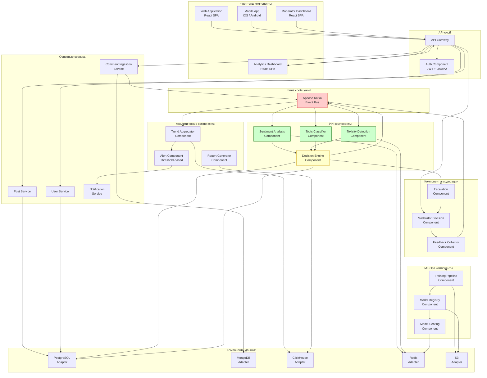

# UML-диаграмма компонентов

## Диаграмма компонентов системы Sentinel AI

## Описание компонентов

| Компонент | Ответственность | Интерфейсы |
|---|---|---|
| **Comment Ingestion** | Приём и валидация входящих комментариев | REST API (POST /comments), Kafka Producer |
| **Post Service** | Управление метаданными постов | REST API (CRUD /posts) |
| **User Service** | Управление профилями пользователей | REST API (CRUD /users) |
| **Sentiment Analysis** | Классификация тональности текста | Kafka Consumer, gRPC (internal) |
| **Toxicity Detection** | Определение токсичности | Kafka Consumer, gRPC (internal) |
| **Topic Classifier** | Категоризация тематики | Kafka Consumer, gRPC (internal) |
| **Decision Engine** | Принятие решения на основе ИИ-оценок | Kafka Consumer/Producer, REST internal |
| **Escalation** | Маршрутизация пограничных случаев | Kafka Consumer, gRPC |
| **Moderator Decision** | Интерфейс для ручной модерации | REST API, WebSocket (real-time) |
| **Feedback Collector** | Сбор фидбека для дообучения моделей | Kafka Consumer, REST internal |
| **Trend Aggregator** | Агрегация трендов тональности | Kafka Consumer, ClickHouse Writer |
| **Alert Component** | Пороговые уведомления | SSE, Push notifications |
| **Training Pipeline** | Дообучение ML-моделей на новых данных | Internal gRPC, S3 Reader/Writer |
| **Model Registry** | Версионирование ML-моделей | REST internal, S3 |
| **Model Serving** | Сервинг моделей для инференса | gRPC, Redis cache |