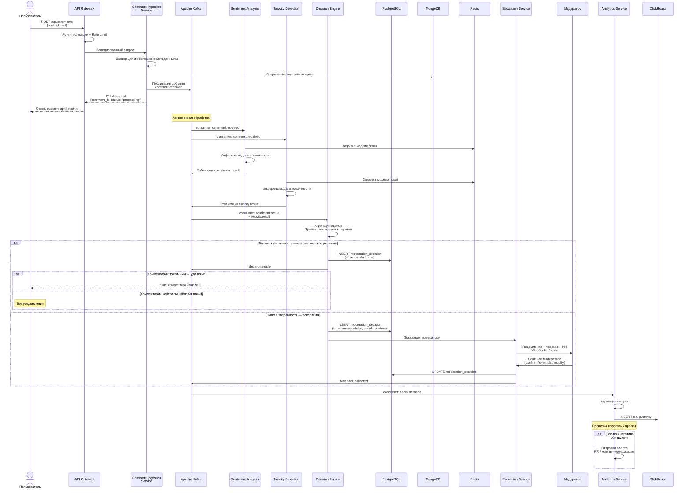
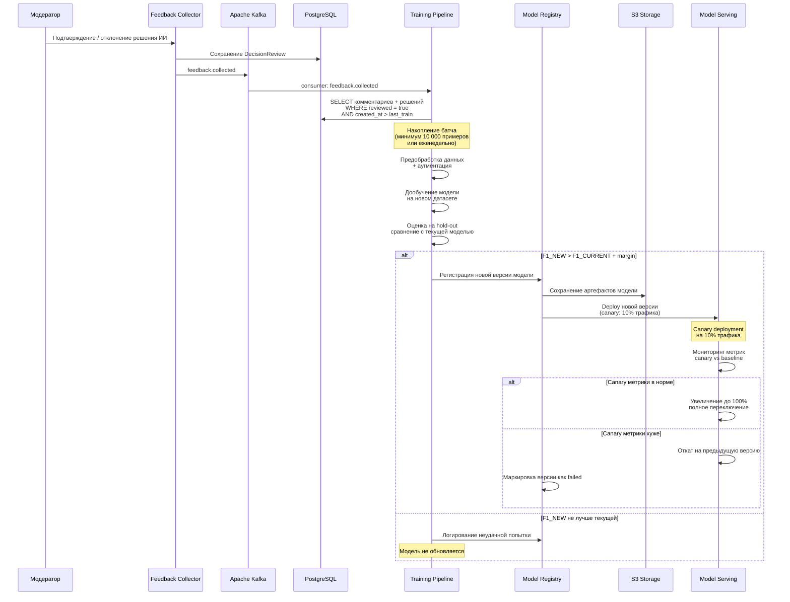

# UML-диаграмма последовательности

## Сценарий: Обработка нового комментария через ИИ-систему

Основной сценарий — автоматическая обработка комментария с высокой уверенностью ИИ (покрывает ≥ 85% случаев).

## Сценарий: Дообучение модели на основе фидбека модераторов

