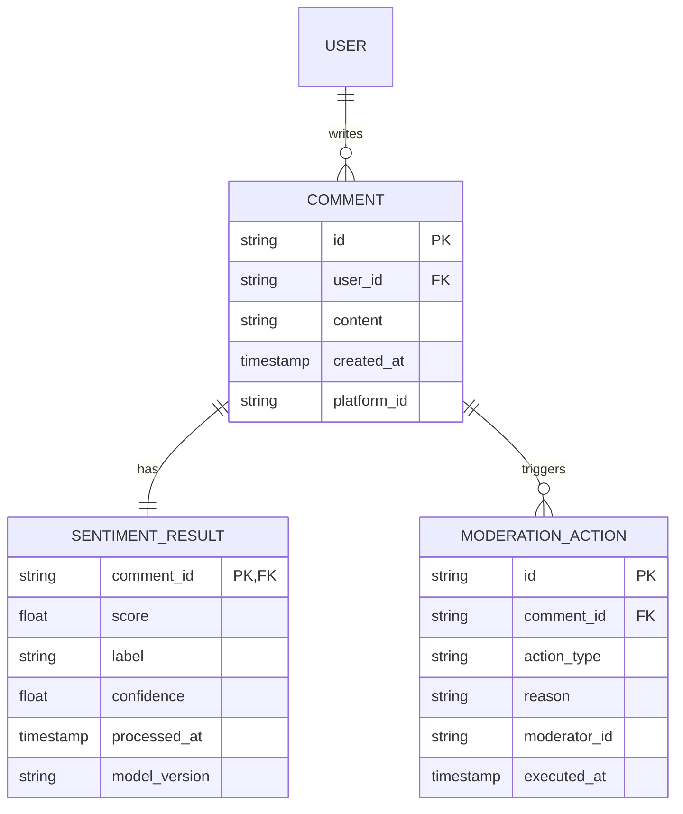

# Структура данных и хранение

## 1. ER-диаграмма

Система использует распределенное хранилище для обеспечения отказоустойчивости и масштабируемости.

## 2. Распределенное хранение данных

Для обработки 500 000 комментариев в день и обеспечения быстрого поиска/аналитики используется гибридная схема:

1. **PostgreSQL (Sharded):**
   - Основное хранилище для метаданных пользователей и комментариев.
   - Используется шардирование по `user_id` для масштабирования записи.

2. **ClickHouse:**
   - Аналитическое хранилище для логов модерации и результатов анализа тональности.
   - Позволяет строить отчеты по вовлеченности и негативу в реальном времени.

3. **Redis:**
   - Кэширование горячих данных и промежуточных результатов анализа.
   - Очереди задач (через Celery или аналоги).

4. **Elasticsearch:**
   - Полнотекстовый поиск по комментариям для модераторов.
   - Быстрое выявление паттернов запрещенного контента.

### Почему распределенное?
- **Масштабируемость:** Нагрузка в 500k/день требует разделения на чтение (аналитика) и запись (комментарии).
- **Отказоустойчивость:** Выход из строя аналитического хранилища не должен блокировать публикацию комментариев.
- **Специфичность задач:** OLTP (Postgres) для транзакций, OLAP (ClickHouse) для аналитики.
