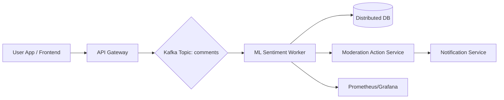
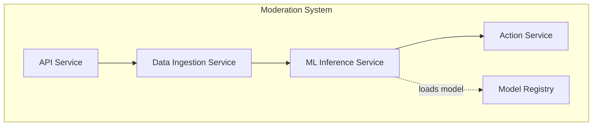
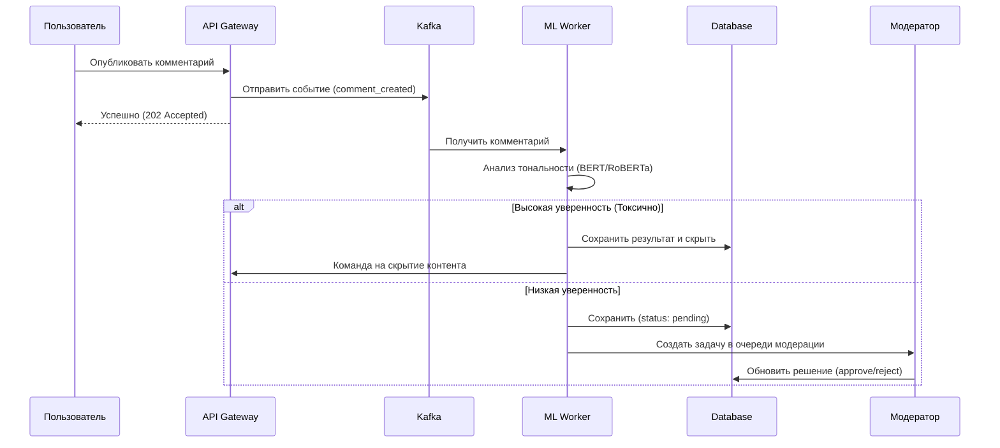

# Архитектура системы

## 1. Общая схема архитектуры

Система построена на микросервисной архитектуре с использованием очередей сообщений для асинхронной обработки.

## 2. UML-диаграмма компонентов

## 3. UML-диаграмма последовательности (Sequence Diagram)

Процесс обработки нового комментария:

## 4. Обоснование выбора технологий
- **Kafka:** Необходима для обработки пиковых нагрузок (500k/день) и обеспечения гарантии доставки сообщений.
- **ML Worker:** Отдельный сервис позволяет масштабировать GPU-ресурсы независимо от API.
- **Model Registry (MLflow):** Для версионирования моделей и быстрого отката в случае деградации метрик.
