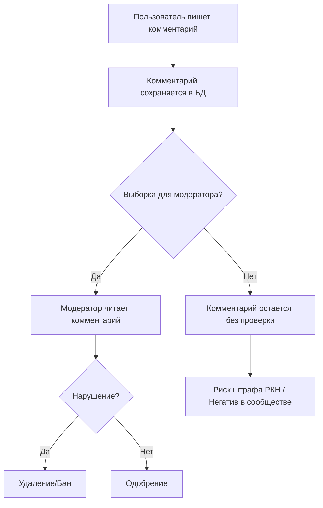
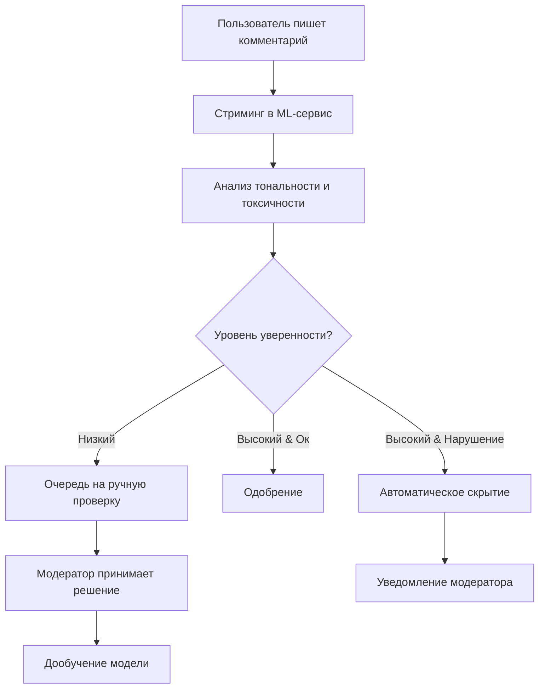

# Бизнес-процессы модерации контента

## 1. Процесс "AS-IS" (До внедрения системы)

В текущем процессе модерация выполняется вручную. Модераторы просматривают случайные выборки комментариев, что приводит к задержкам и пропускам нарушений.

## 2. Процесс "TO-BE" (После внедрения ML-системы)

В новом процессе каждый комментарий проходит через автоматизированную систему анализа тональности и фильтрации.

### Основные изменения:
1. **Автоматизация:** 100% комментариев проходят проверку.
2. **Скорость:** Реакция на явный негатив происходит мгновенно.
3. **Оптимизация:** Модераторы работают только со спорными случаями.
4. **Безопасность:** Снижение риска штрафов РКН за счет превентивной фильтрации.
